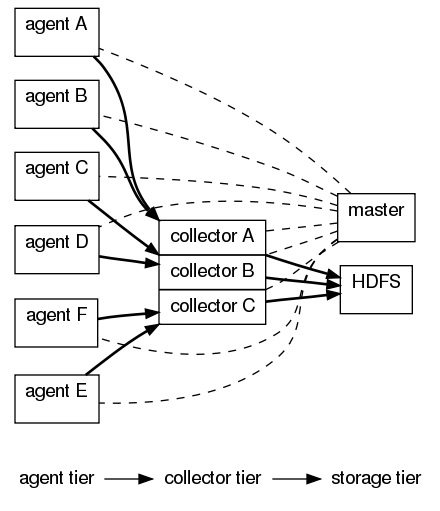
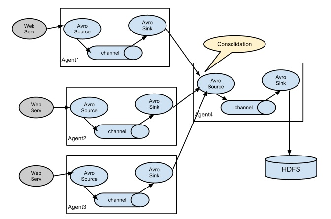
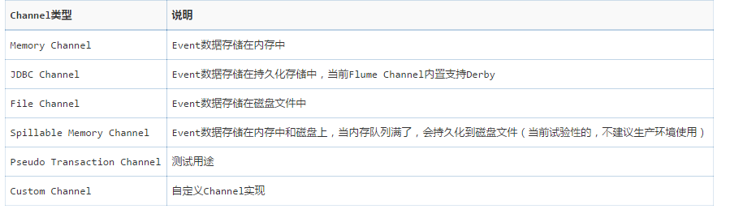
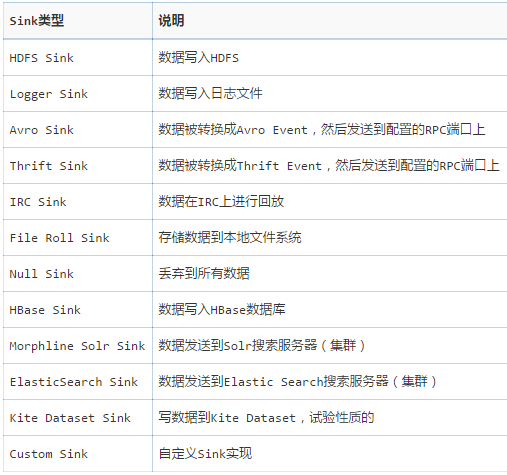
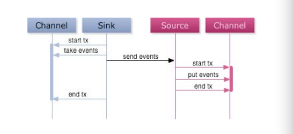
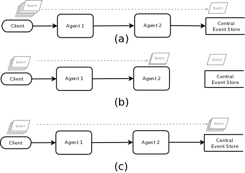
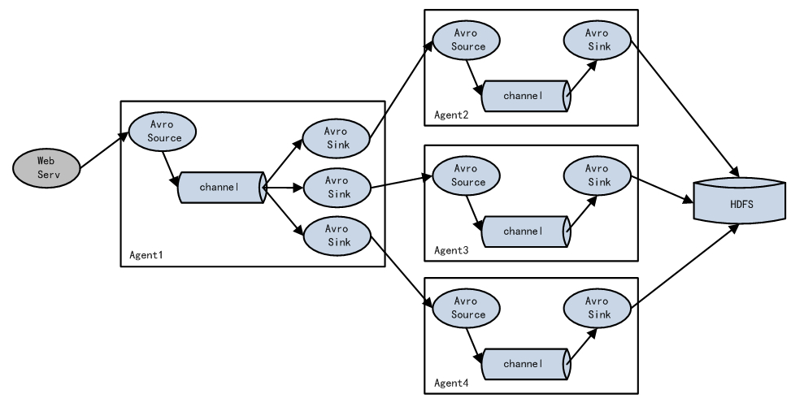

#声明
我对Flume的研究并不深，这一篇文章来源于2016年3月的某一个下午对Flume的调研，仅有一个下午，所以可能有一些观点是不对的。另外，文章很多内容来源于一些大神的博文，当时匆匆没有记录引用来源。所以，如果有人可以发现本文的错误，以及引用的文章，还请在留言中指出。万分感谢。
#Flume OG
Flume OG：Flume Original Generation，初代Flume。
由三种角色构成：代理点（agent）、收集节点（collector）、主节点（master）
* agent 从各个数据源收集日志数据，将收集到的数据集中到 collector，然后由收集节点汇总存入 hdfs。
* master 负责管理 agent，collector 的活动。
* agent、collector 都称为 node，node 的角色根据配置的不同分为 logical node（逻辑节点）、physical node（物理节点）。对 logical nodes 和 physical nodes 的区分、配置、使用一直以来都是使用者最头疼的地方。
* agent、collector由Source、Sink组成，当前节点的数据是从Source传送到Sink的。

#Flume NG
Flume NG：Flume New Generation
* NG只有一种角色节点：代理点（agent）。
* 没有collector、master节点。这是核心组件最核心的变化。
* 去除了 physical nodes、logical nodes 的概念和相关内容。
* agent 节点的组成也发生了变化。NG agent 由 source、sink、channel 组成。
* NG删减了角色，脱离了对Zookeeper的依赖

# Flume NG分析
##基本概念
* Event：一个数据单元，带有一个可选的消息头。
* Flow：Event从源点到达目的点的迁移的抽象。
* Client：操作位于源点处的Event，将其发送到Flume Agent。
* Agent：一个独立的Flume进程，包含组件Source、Channel、Sink。
* Source：用来消费传递到该组件的Event ，存入channel中。
* Channel：中转Event的一个临时存储，保存有Source组件传递过来的Event。
* Sink：从Channel中读取并移除Event，将Event传递到Flow Pipeline中的下一个Agent（如果有的话）。
## 数据流：
Flume 的核心是把数据从数据源收集过来，再送到目的地。为了保证输送一定成功，在送到目的地之前，会先缓存数据，待数据真正到达目的地后，删除自己缓存的数据：当sink写入失败后，可以自动重启，不会造成数据丢失，因此很可靠。
Flume 传输的数据的基本单位是 Event，如果是文本文件，通常是一行记录，这也是事务的基本单位。Event 从 Source，流向 Channel，再到 Sink，本身为一个 byte 数组，并可携带 headers 信息。Event 代表着一个数据流的最小完整单元，从外部数据源来，向外部的目的地去。
##核心组件：
###Source
* ExecSource: 以运行 Linux 命令的方式，持续的输出最新的数据，如 tail -F 文件名 指令，在这种方式下，取的文件名必须是指定的。 ExecSource 可以实现对日志的实时收集，但是存在Flume不运行或者指令执行出错时，将无法收集到日志数据，无法保证日志数据的完整性。 
* SpoolSource: 监测配置的目录下新增的文件，并将文件中的数据读取出来。需要注意两点：拷贝到 spool 目录下的文件不可以再打开编辑；spool 目录下不可包含相应的子目录。SpoolSource无法实现实时的收集数据，但可以设置以分钟的方式分割文件，趋于实时。
###Channel
  Memory Channel, JDBC Channel , File Channel，Psuedo Transaction Channel。比较常见的是前三种 channel。
*  MemoryChannel 可以实现高速的吞吐，但是无法保证数据的完整性。 
*  MemoryRecoverChannel 在官方文档的建议上已经建义使用FileChannel来替换。
*  FileChannel保证数据的完整性与一致性。在具体配置FileChannel时，建议FileChannel设置的目录和程序日志文件保存的目录设成不同的磁盘，以便提高效率。

###Sink

## 可靠性
在Flume NG中，可靠性指的是在数据流的传输过程中，保证events的可靠传递。
在Flume NG中，所有的events都保存在Agent的Channel中，然后被发送到数据流下一个Agent或者最终的存储服务中。当且仅当它们被保存到下一个Agent的Channel中，或者被保存到最终的存储服务中。这就是Flume 提供数据流中点到点的可靠性保证的最基本的单跳消息语义传递。
首先，Agent间的事务交换。Flume使用事务的办法来保证events的可靠传递。Source和Sink分别被封装在事务中，这些事务由保存event的存储提供或者由Channel提供。这就保证了event在数据流的点对点传输中是可靠的。在多级数据流中，如下图，上一级的Sink和下一级的Source都被包含在事务中，保证数据可靠地从一个Channel到另一个Channel转移。

下图A：正常情况下的 events流程。
下图B：Agent2 跟central event store失联，Agent2提交的事务失败，将events缓存起来。
下图C：重新恢复时，再恢复失联之前的任务以及后续的events发送。

##高可用
如下图所示，Agent1中，只有要有一个Sink组件可用，events就被传递到下一个组件，如果一个Sink能成功处理Event（事务完成），则会加入到一个Pool中， 否则，则会从Pool中移除，并计算失败次数，设置惩罚因子。所以，如果某一个Flow中某一层的Agent只有一个，或者全部宕机，可能导致这些Events被存储在流水线上最后一个存活节点。
